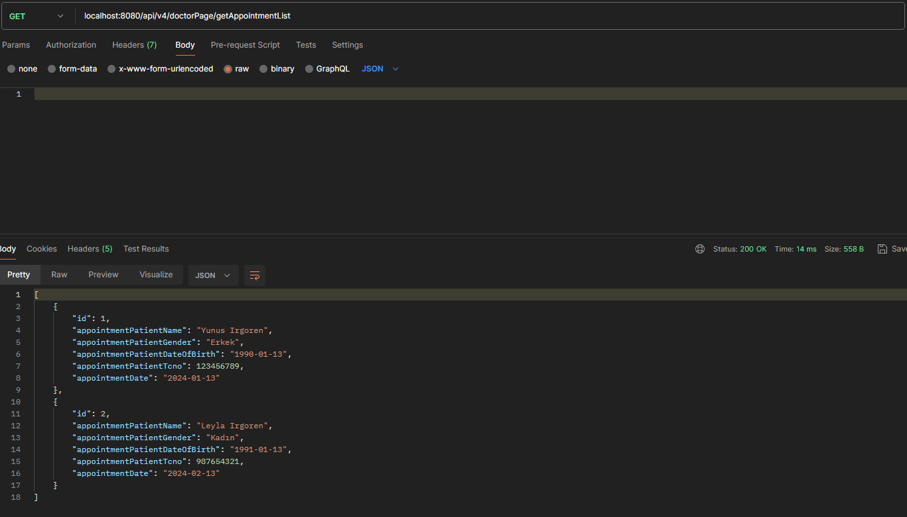
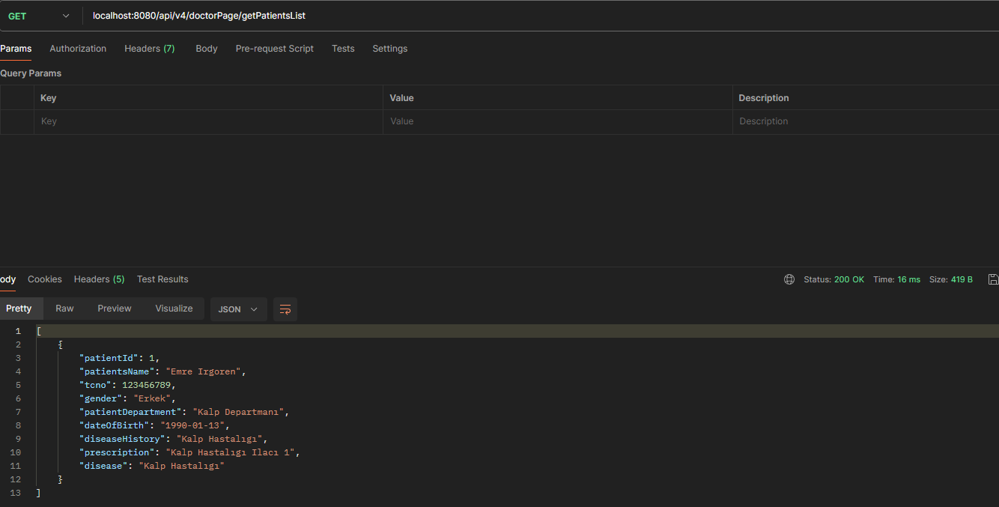
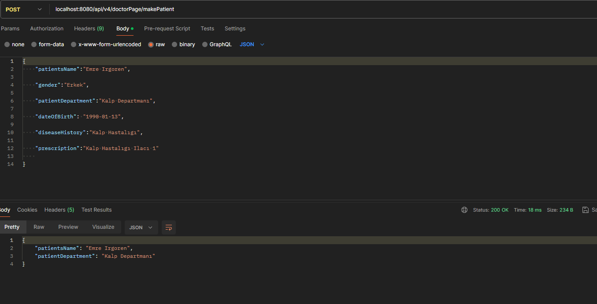
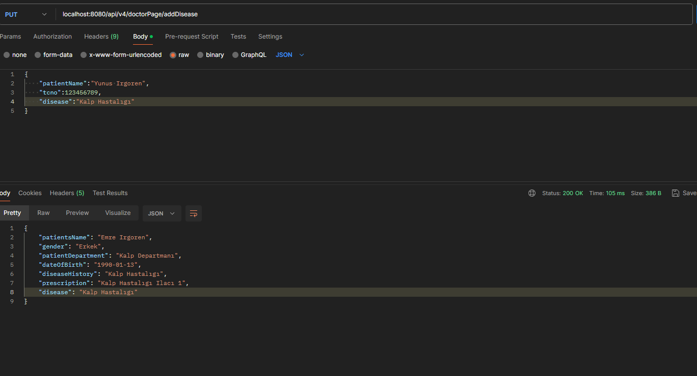
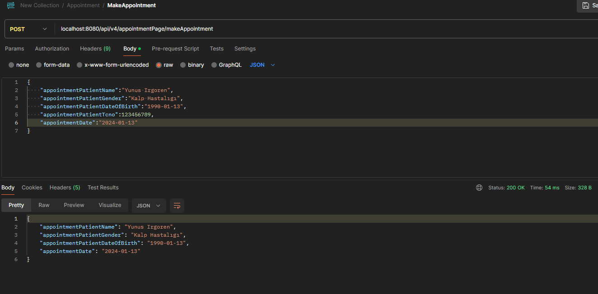
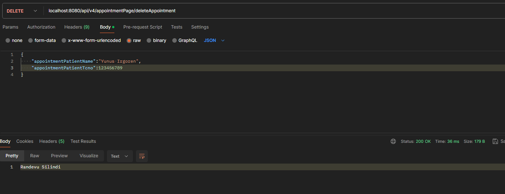

# Hospital Api-V4

Doktor kullanıcısı randevulu hasta listesini ve serviste yatan hasta listesini getirebilir. Hasta yatışı yapabilir ve hastaya hastalık bilgisi ekleyebilir. Bu isteklerin detayları asagıda verilmistir.

# Api Kullanımı

#### Randevulu Hasta Listesi Getirme

```http
  POST http://localhost:8080/api/v4/doctorPage/getAppointmentList
```

<p align="center">
    
</p>

#### Serviste Yatan Hasta Listesi Getirme

```http
  POST http://localhost:8080/api/v4/doctorPage/getPatientsList
```

<p align="center">
    
</p>

#### Hasta Yatışı

```http
  POST http://localhost:8080/api/v4/doctorPage/makePatient
```

<p align="center">
    
</p>

#### Hastalık Bilgisi Ekleme

```http
  POST http://localhost:8080/api/v4/doctorPage/addDisease
```

<p align="center">
    
</p>

Randevu Sisteminde hasta randevu alabilir, güncelleyebilir ve silebilir.

# Api Kullanımı

#### Randevu Alma

```http
  POST http://localhost:8080/api/v4/appointmentPage/makeAppointment
```

<p align="center">
    
</p>

#### Randevu Güncelleme

```http
  POST http://localhost:8080/api/v4/appointmentPage/updateAppointment
```

<p align="center">
    
</p>

#### Randevu Silme

```http
  POST http://localhost:8080/api/v4/appointmentPage/deleteAppointment
```

<p align="center">
    
</p>

## Projede Kullanılan Teknolojiler

- Java 17
- Spring Boot 3.2.2
- Maven
- Lombok
- Restful API
- Postman
- MySql

## İletişim

- 📫 mail : **emreirgoren@outlook.com**


